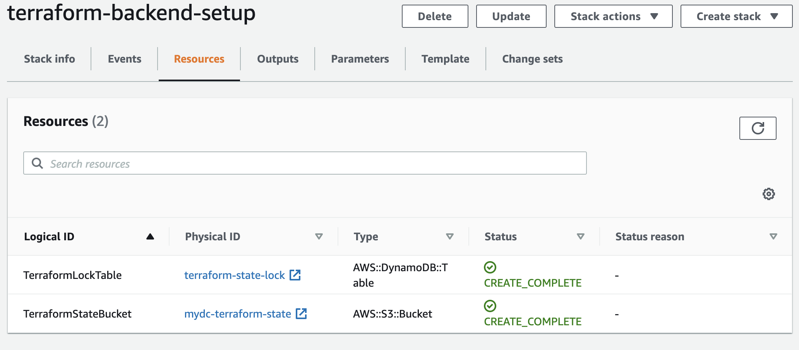

# Backend setup for terraform in AWS

Use the `Cloudformation` script to setup Terrafrom Backend in `S3` and `DynamoDb`, it should only run once

> It should only run once, you should configure your environment variable `BUCKET_NAME` and `LOCK_TABLE_NAME`

## How to run in AWS Console

Use it in AWS Console, select the backend.yml, and fill in `BUCKET_NAME` and `LOCK_TABLE_NAME`

1. Navigate to CloudFormation
2. Create stack (with new resources)
3. Specify template and select `backend.yml` from your local, click next
4. Fill in `Stack name`, e.g: `terraform-backend-setup`
5. Fill in `LockTableName` Parameters, e.g: `terraform-state-lock`
6. Fill in `StateBucketName` Parameters, e.g: `terraform-s3-state-random`, it must be unique across AWS
7. Click next, and continue until `Create stack`, your resource should be ready within 1 min

## How to run with AWS CLI

Run the following script to create:-

```
aws cloudformation create-stack --stack-name terraform-backend-setup --template-body file://backend.yml --parameters ParameterKey=LockTableName,ParameterValue=terraform-state-lock ParameterKey=StateBucketName,ParameterValue=terraform-s3-state-random
```

Run the following script to check stack status:-

```
aws cloudformation describe-stacks --stack-name terraform-backend-setup
```

## Use the s3 bucket to configure your backend, your credential require to have permission to read and write to this backend



## To delete stack

Run the following script:-

```
aws cloudformation delete-stack --stack-name terraform-backend-setup
```
